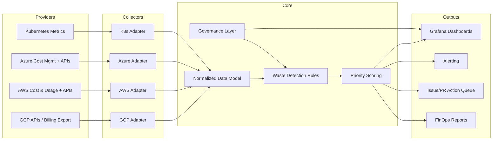

# Architecture Overview

## Intent

This project is a reusable FinOps accelerator built around a provider-agnostic core and cloud-specific adapters.

## System Diagram

## Key Design Principles

- Provider adapters isolate API differences.
- Core rules/scoring remain reusable across clouds.
- Governance artifacts (runbooks, review cadence, DoD) are first-class.
- Security by default: least privilege, no secrets in code, auditable automation.

## Adapter Contract

Provider adapter contract reference:

- `docs/provider-adapter-contract.md`
- `scripts/adapters/base.py`
